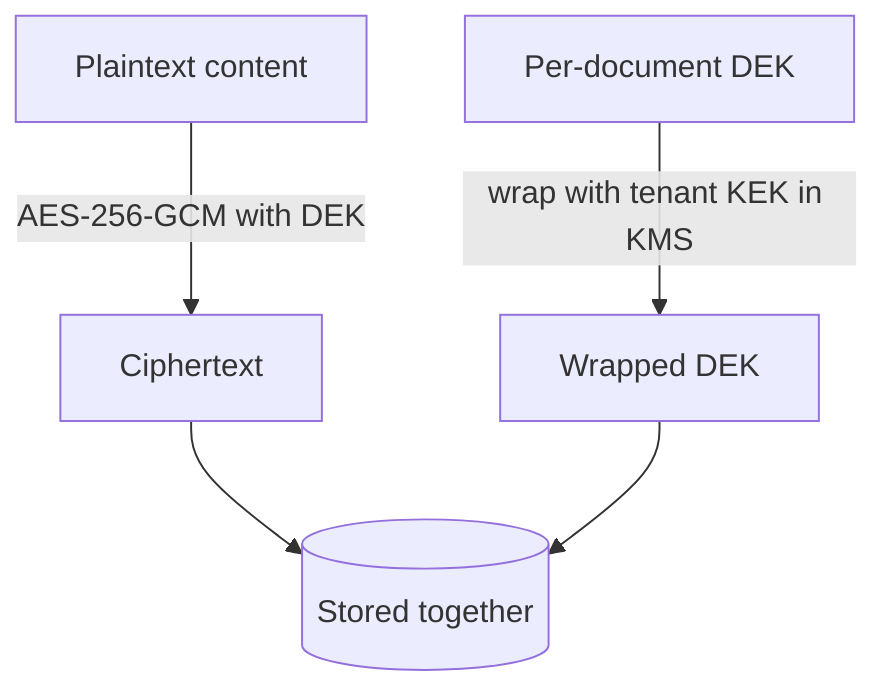

# Security & BYOK

Encryption and key management are first-class, not bolted on. The model is
**Bring-Your-Own-Key (BYOK) envelope encryption** with **crypto-shredding**.

::: callout info "In plain words"
Your ingested content is encrypted at rest, and *you* control the keys (that's
BYOK). To honour a "delete all my data" request, you don't have to hunt down
every copy and backup — you destroy the key, and the data becomes permanently
unreadable everywhere at once (that's *crypto-shredding*). The two terms below,
**DEK** and **KEK**, are just "the key that locks the data" and "the key that
locks the keys".
:::

## Envelope encryption

Each piece of sensitive content (source body, chunk text, sensitive metadata) is
encrypted with a fresh **Data Encryption Key (DEK)**. The DEK itself is never
stored in plaintext — it is *wrapped* (encrypted) by the tenant's **Key
Encryption Key (KEK)**, which lives inside a KMS.



```php
use Sellinnate\RagEngine\Facades\Rag;

$payload = Rag::encrypter()->encrypt('confidential', 'tenant-42');
// $payload = ciphertext + wrappedDek + keyId   (no plaintext key anywhere)

$plain = Rag::encrypter()->decrypt($payload);
```

The plaintext DEK exists only in memory for the duration of an operation, then
is discarded. Only the wrapped DEK is persisted.

## KMS abstraction

The `KeyManagement` contract abstracts the KMS. The package ships:

- a **`local`** driver that keeps tenant KEKs in a pluggable
  [key store](#kms-key-stores) (in-memory, file or database), and
- a production **`aws`** driver (AWS KMS).

GCP KMS, Azure Key Vault and HashiCorp Vault fit the same contract and can be
added via `KmsManager::extend()`.

```php
$kms = Rag::kms();
$kms->createKey('tenant-42');
$dataKey = $kms->generateDataKey('tenant-42'); // {plaintext, wrapped}
$kms->rotateKey('tenant-42');                  // non-destructive
```

### Local KMS key stores {#kms-key-stores}

The `local` driver keeps each tenant's KEK in a **key store**, chosen with
`RAG_KMS_STORE`:

| `RAG_KMS_STORE` | Where KEKs live | Use it for |
|---|---|---|
| `array` (default) | PHP memory — gone when the process ends | Tests and local experiments |
| `file` | One file per KEK under `RAG_KMS_KEYSTORE` | A **single** server with a persistent disk |
| `database` | The `rag_kms_keys` table | **Multi-node or ephemeral-disk hosting** (Laravel Cloud, Vapor, Kubernetes…) |

::: callout warning "`array` loses every key on restart"
With the in-memory store, a new process has no KEKs, so nothing encrypted by an
earlier process can be decrypted. Never use it outside tests.
:::

#### The `database` key store

Every web node and queue worker reads the same table, so a key created on one
node works everywhere, and destroying it shreds the data for every node at once.

```dotenv
RAG_KMS=local
RAG_KMS_STORE=database
# REQUIRED: at least 32 characters. Generate one with:
#   php -r "echo base64_encode(random_bytes(32)), PHP_EOL;"
RAG_KMS_MASTER_KEY=
# Optional: the DB connection that holds rag_kms_keys (default: your app's default connection)
# RAG_KMS_CONNECTION=mysql
```

How it protects the keys:

- **KEKs are always encrypted with the master key** (AES-256-GCM) before they
  are written. If `RAG_KMS_MASTER_KEY` is missing or shorter than 32 characters,
  the driver **refuses to start** with a clear `EncryptionException`. It never
  falls back to storing keys in plaintext.
- Rows are keyed by the **SHA-256 of the tenant id**, and each encrypted row is
  bound to its key id, so a row copied onto another tenant is rejected.
- **Crypto-shredding is a hard `DELETE`** of the row (`destroyKey()` /
  `rag:purge`).
- Creating a key is an **atomic insert-if-absent**, so two nodes provisioning
  the same tenant at once can't overwrite each other's key. **Rotation** is an
  atomic read-modify-write (`SELECT … FOR UPDATE`), so concurrent rotations
  never drop a key version. Keys are read with
  a locking read, so a node inside a long MySQL/MariaDB `REPEATABLE READ`
  transaction still sees a key another node has just committed.

The table comes from the package migration `create_rag_kms_keys_table`
(publish tag `rag-engine-migrations`). If you set `RAG_KMS_CONNECTION`, the
migration creates the table on that connection.

::: callout warning "Keep the master key out of the database"
Store `RAG_KMS_MASTER_KEY` in your host's secret manager, never next to the data.
Anyone who has both the database and the master key can decrypt everything.
Database **backups** still contain the *encrypted* KEK rows of a shredded tenant.
Those rows stay unreadable only while the master key is secret, so cover them in
your backup-retention policy (or rotate to a new master key and re-encrypt).
For key custody outside your infrastructure, use the `aws` driver.
:::

### AWS KMS (production BYOK)

Requires `aws/aws-sdk-php` (`composer require aws/aws-sdk-php`). It uses **one
Customer Master Key (CMK) per tenant** (alias `alias/{prefix}{tenant}`), so
crypto-shredding one tenant never touches another. DEKs are generated, wrapped
and unwrapped *inside* KMS — the plaintext KEK never leaves AWS.

```dotenv
RAG_KMS=aws
RAG_AWS_KMS_REGION=eu-west-1
# Credentials resolve via the standard AWS chain (env / profile / IAM role);
# set these only to override:
# RAG_AWS_KMS_KEY=...
# RAG_AWS_KMS_SECRET=...
# RAG_AWS_KMS_ALIAS_PREFIX=alias/rag-
# RAG_AWS_KMS_DELETION_WINDOW=7      # days (AWS enforces 7–30)
```

::: callout warning "AWS crypto-shred is disable-now, delete-later"
`destroyKey()` (and `rag:purge`) **disables** the tenant's CMK immediately —
making the data instantly undecryptable — then **schedules** its deletion within
the AWS-enforced 7–30 day window. The key is unusable at once; permanent deletion
completes after the window. Each tenant CMK incurs the standard AWS KMS monthly
cost.
:::

## Crypto-shredding (right to erasure)

Deleting a tenant or document does not require scrubbing every derived copy.
Instead you **destroy the key** — and every value *encrypted* under it (source
content, chunk text in the DB) becomes permanently unrecoverable, including in
DB backups. Plaintext vectors are additionally **deleted from the live vector
store** (across every namespace the tenant used); see the boundary note below.

```php
Rag::kms()->destroyKey('tenant-42');
// All content wrapped under tenant-42's KEK can no longer be decrypted.
```

::: callout warning "The honest boundary on vectors"
Embedding **vectors** are **not** BYOK-encrypted, because
approximate-nearest-neighbour search needs the numbers in the clear. Vectors and
their metadata live inside the **tenant perimeter**, and their at-rest protection
depends on the vector store's own encryption (e.g. Qdrant/disk encryption).
With encryption on, the chunk **text** is no longer copied into the vector store
by default (see below). Crypto-shredding a tenant explicitly **deletes** its
vectors from the live store. Backups of the vector store made before that are
outside the key-destruction guarantee; handle them with your backup-retention
policy.
:::

## Keeping plaintext out of the vector store {#vector-payload-content}

Each chunk's text is always stored **encrypted** in `rag_chunks`. The setting
`security.vector_payload_content` decides whether a **plaintext copy** is also
written into the vector store (the payload in Qdrant/`database`/memory, and the
`content` column in pgvector):

| `RAG_VECTOR_PAYLOAD_CONTENT` | Plaintext in the vector store? |
|---|---|
| *unset* (default, "auto") | **No** when `RAG_ENCRYPTION_ENABLED=true`; yes when encryption is off. |
| `false` | Never. |
| `true` | Always (the behaviour before v1.3). |

When the vector store holds no text, search **hydrates** each hit: it loads the
matching `rag_chunks` rows in **one batched query, scoped to the current tenant**,
and decrypts them. Hybrid keyword scoring, deduplication, MMR, reranking, parent
expansion, context budgets, `Rag::ask()` and evaluation all work on the
decrypted text as before. A hit whose chunk row is missing (an orphan vector) or
belongs to another tenant is **dropped**.

::: callout info "Why this is the default"
With encryption on, the chunk text was previously encrypted in your database but
readable in plain text in the vector store, often a separate service with its own
backups. Leaving the copy out means crypto-shredding the key protects the text
everywhere. The cost is a few extra decryptions per search (one per returned
candidate). Set `RAG_VECTOR_PAYLOAD_CONTENT=true` only if you need the text in
the store itself, e.g. for tools that read Qdrant directly.
:::

::: callout warning "Upgrading from v1.2 or earlier"
Vectors written before the upgrade **still contain plaintext** until they are
rebuilt. They keep working, because search uses the payload text when it's
present. To strip the text, re-index each tenant with `rag:reindex` (below).
:::

```bash
php artisan rag:reindex {tenant}
```

`rag:reindex` rebuilds every current document of the tenant from its encrypted
source, in the namespace it already lives in. Eloquent documents are re-synced
from the live model (a document whose model was deleted is removed). It prints a
summary and exits non-zero if any document failed.

## Audit log triggers {#audit-triggers}

The audit log (`rag_audit_entries`) is append-only and hash-chained. The package
migration also installs **database triggers** that reject every `UPDATE`/`DELETE`,
no matter how the table is accessed.

Some managed MySQL hosts reject `CREATE TRIGGER` (no `SUPER` privilege, or
binary-logging restrictions), which makes the migration fail. On those hosts,
turn the triggers off **before** running the migration:

```dotenv
RAG_AUDIT_DB_TRIGGERS=false
```

The **application-level guard** stays on either way: updating or deleting an
`AuditEntry` model throws. Without the triggers, though, raw queries
(`DB::table(...)`) can bypass that guard, so keep database write access to the
audit table limited.

## Key rotation

A KEK can be rotated without re-ingesting data. The local KMS keeps every KEK
version: new DEKs are wrapped with the newest version, while previously wrapped
DEKs continue to unwrap — so rotation is non-destructive.

## Best practices

- **Keep encryption enabled** (`RAG_ENCRYPTION_ENABLED=true`) for any sensitive
  corpus — it's the basis of crypto-shredding.
- **Use a real KMS in production.** Prefer `aws` (or another cloud KMS via
  `KmsManager::extend()`) for key custody. If you use `local`, pick the
  `database` store on multi-node hosting and keep `RAG_KMS_MASTER_KEY` in a
  secret manager. Never use the `array` store in production.
- **Erase via the key, not by hand.** To honour erasure, `destroyKey()` /
  `rag:purge` the tenant — don't try to scrub individual rows.
- **Keep plaintext out of the vector store** (the default with encryption on),
  and run `rag:reindex` after upgrading from v1.2 or earlier.
- **Encrypt your vector store at rest too.** Vectors and their metadata are
  *not* BYOK-encrypted (see the boundary note above); rely on the store's own
  disk/volume encryption.
- **Define a backup-retention policy.** Crypto-shredding covers live data and the
  live vector store; pre-existing *backups* are governed by your retention policy.
- **Rotate keys periodically** with `rag:rotate-keys` — it's non-destructive.

## What is verified by tests

The package's test suite asserts these as invariants:

- AES-256-GCM detects tampering and rejects wrong keys.
- A destroyed key makes previously encrypted data unrecoverable.
- Rotation keeps old data readable **and** uses the newest key for new data.
- Tenant keys are isolated: a DEK wrapped under tenant A cannot be unwrapped under tenant B.
- The `database` key store refuses to run without a master key, never stores a
  KEK unencrypted, detects swapped rows and hard-deletes on shred.
- With encryption on, no chunk text reaches the vector store, and search results
  are hydrated only from the current tenant's chunk rows.
